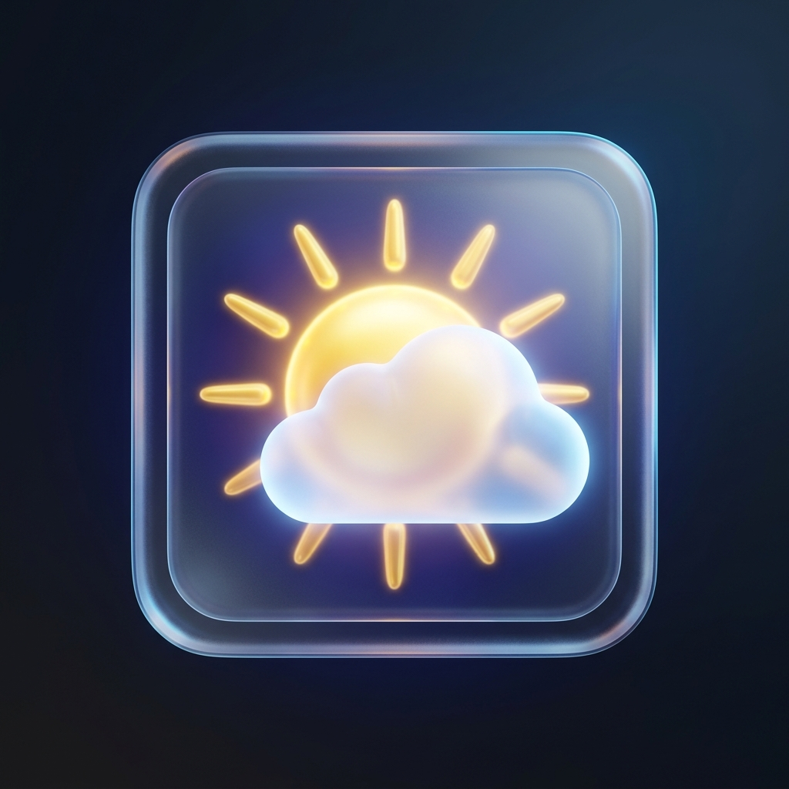

# Live Weather Dashboard ☀️🌦️❄️

A premium, state-of-the-art, fully responsive Meteorological Dashboard web application built using modern HTML5, CSS3, and Vanilla JavaScript (ES6+). Featuring an Apple Weather-style glassmorphism UI, dynamic canvas-based weather particle animations, charts, voice assistants, and offline PWA support.



## 🌟 Key Features

* **Glassmorphism UI**: Beautiful iOS-style cards, saturated blurs, clean borders, dynamic shadows, and high contrast typography using Google Fonts (Outfit & Inter).
* **Live Weather Data (Zero-Key)**: Powered by the free **Open-Meteo API** out of the box, showing 100% real, live temperature, wind speed, pressure, UV index, and forecast for any city without requiring an API key.
* **OpenWeatherMap Integration**: Support for custom OWM API keys in Settings.
* **Canvas Particle Engine**: Renders dynamic, interactive weather backdrops:
  * **Sunny**: Warm, floating golden sunbeam bubbles.
  * **Rain**: Falling slanted water drops.
  * **Snow**: Swirling, soft horizontal drifting circular flakes.
  * **Cloudy**: Huge, slow-drifting mist/fog blocks.
  * **Night**: Twinkling star patterns.
  * **Thunderstorm**: Fast rain streaks + sudden lightning flash backdrops.
* **Voice Assistant (Web Speech API)**: Click the microphone or press `Ctrl + M` to command searches verbally (e.g., *"Show weather in Tokyo"*). Built-in speech synthesis speaks the current weather summary back to you.
* **Interactive Charts (Chart.js)**: Line charts showing 24-hour temperature forecasts and bar charts visualizing wind speeds, styled to match light/dark themes.
* **PWA Offline Support**: Fully installable as a Progressive Web App, caching all static content and dependencies via a Service Worker for offline queries.
* **Utility Exports**: Captures the dashboard card grid to download as a PDF report (`jsPDF` + `html2canvas`) or save as a PNG screenshot.

---

## 📂 Project Structure

```
/weather-app
├── index.html            # Main markup page & CDNs
├── style.css             # Glassmorphism tokens, keyframes, and themes
├── script.js             # State orchestrator & Canvas animation loops
├── api.js                # Open-Meteo & OWM API adapters
├── charts.js             # Chart.js renderers
├── notifications.js      # Toast system and browser push manager
├── voice.js              # Speech recognition and voice synthesis
├── service-worker.js     # PWA cache routing
├── manifest.json         # PWA app parameters
└── assets/
    └── logo.png          # App branding logo
```

---

## 🚀 Getting Started

To run the application locally, initialize the server inside the project folder:

```bash
# Clone the repository
git clone https://github.com/Shibukumar69/weather-app.git
cd weather-app

# Run a local web server (Python)
python -m http.server 3000

# Or run with Node package manager (Vite or http-server)
npm install
npm run dev
```

Open your browser and navigate to `http://localhost:3000`.

---

## 🎨 Visual Widgets
* **Sun Arc Progress Bar**: Traces the sun's trajectory dynamically relative to current local time.
* **Wind Compass**: Rotating compass needle mapping the actual wind degrees.
* **Humidity circle**: Dynamic circular stroke matching percentages.
* **Air Quality Slider**: 5-point European AQI index representation bar.
